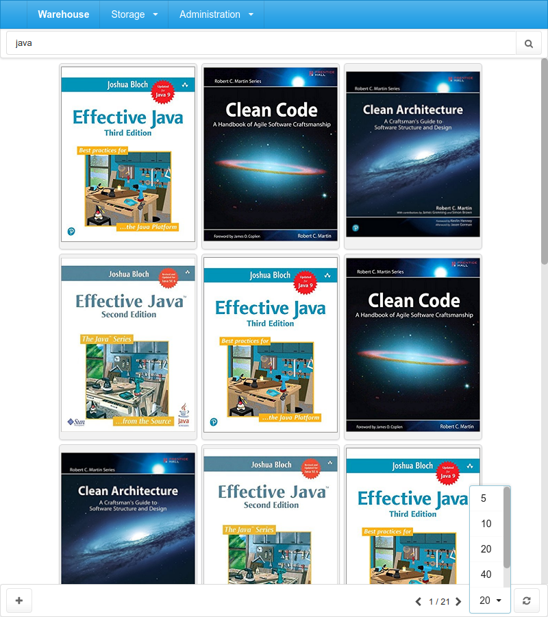
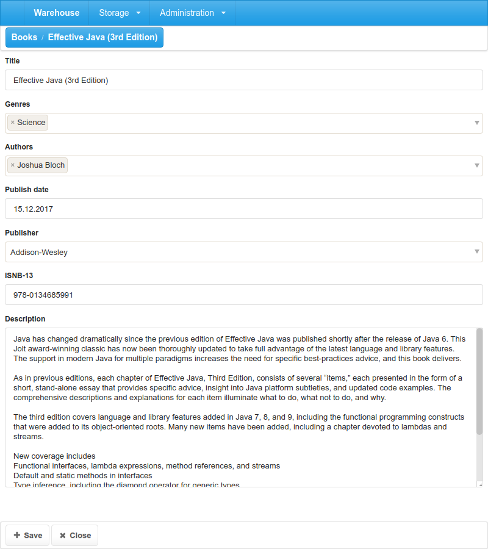
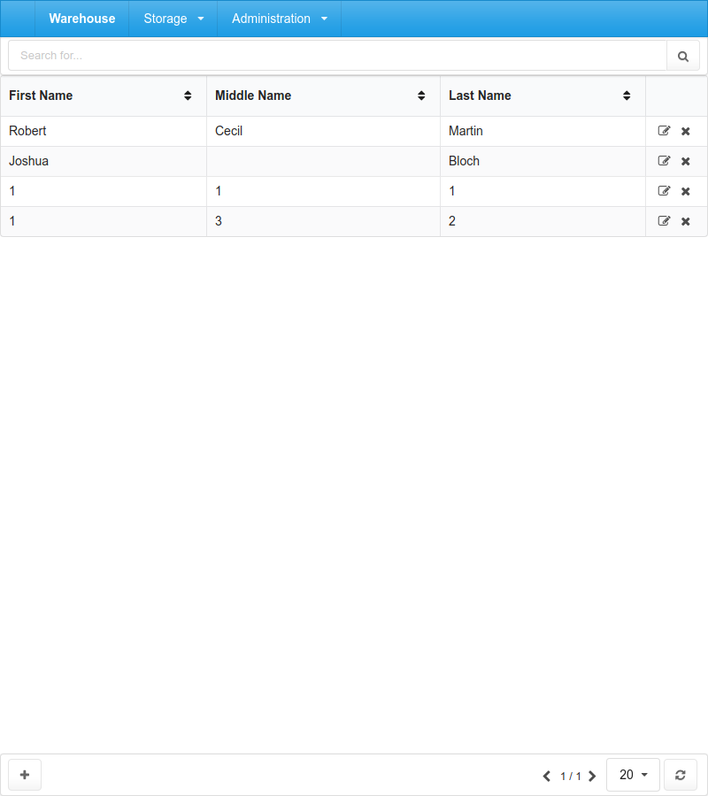
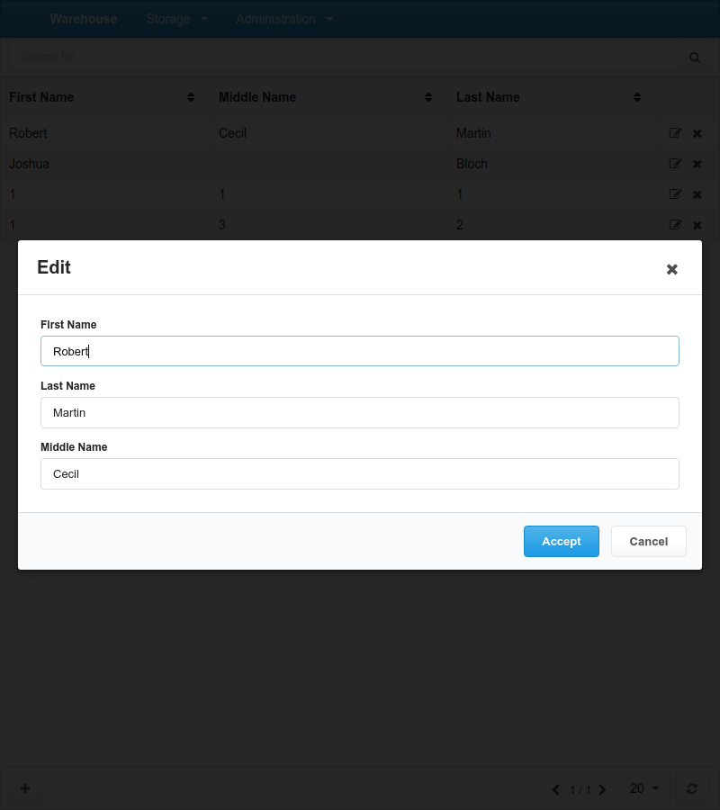
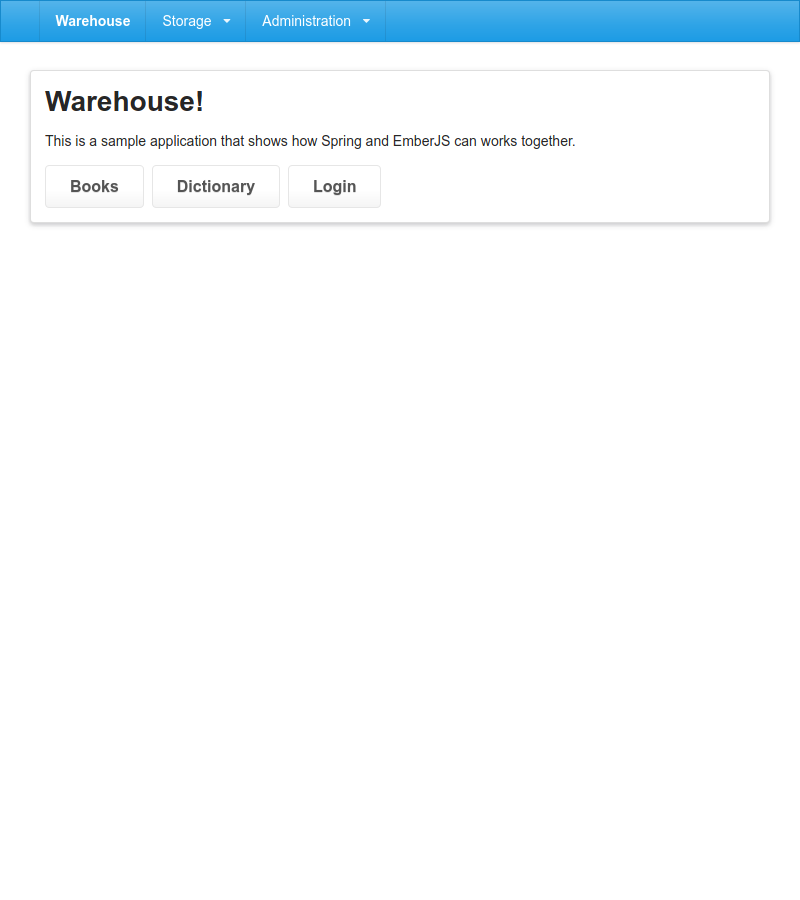

# Warehouse

- Maven v3.x
- H2
- Spring Boot v1.5.9 
- EmberJS v2.17

## Build
```
mvn clean install -Pui
```

### Checkstyle

```
mvn clean install -Pcheckstyle
```

### Docker

```
mvn clean install -Pdocker
```

```
docker run -p 8080:8080 -t warehouse/webserver
```

## Run
```
java -jar launcher/web-server/target/launcher-web-server-1.0-SNAPSHOT.jar
```

The application will be available at http://localhost:8080

Default user:
- name: admin
- pass: admin

## EmberJS
 
### Debug mode

Run the command below in the folder `ui/webui`.
```
ember serve
```
The page will be available at http://localhost:4200

### Semantic UI 

#### Build

```
npm run-script semantic-ui-build
```
or
```
gulp build --gulpfile vendor/semantic-ui/gulpfile.js
```

#### Watching for changes

```
npm run-script semantic-ui-watch
```
or
```
gulp watch --gulpfile vendor/semantic-ui/gulpfile.js
```

## H2 Console

- http://localhost:8080/console
  - user: admin
  - pass: admin
- databse credentials:
  - user: sa
  - pass:

## Screenshots

### Books : Index

### Books : Edit

### Author : Index

### Author : Edit

### Index

### Login
