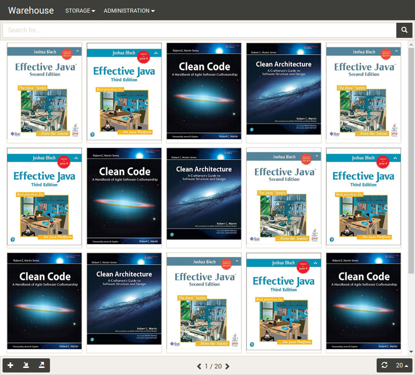
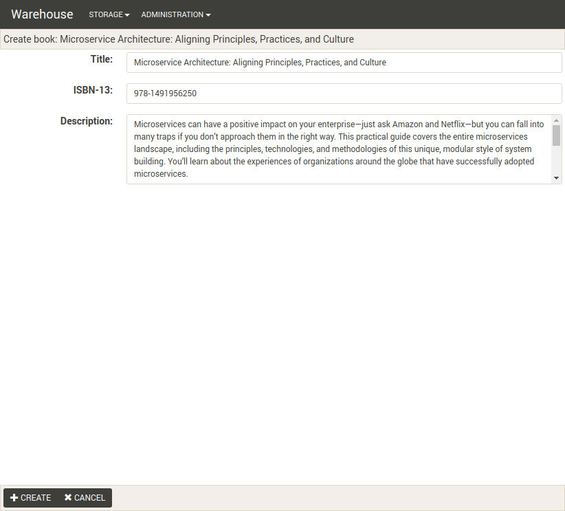

# Warehouse

- Maven v3.x
- H2
- Spring Boot v1.5.9 
- EmberJS v2.17

## Build
```
mvn clean install -Pui -T4
```

## Run
```
java -jar launcher/web-server/target/launcher-web-server-1.0-SNAPSHOT.jar
```

## EmberJS debug mode

Run the command below in the folder `ui/webui`.
```
ember serve
```
The page will be available at http://localhost:4200

## H2 Console

- url: http://localhost:8080/console
- user: sa
- pass:

## Screenshots

### Browse



### Edit


